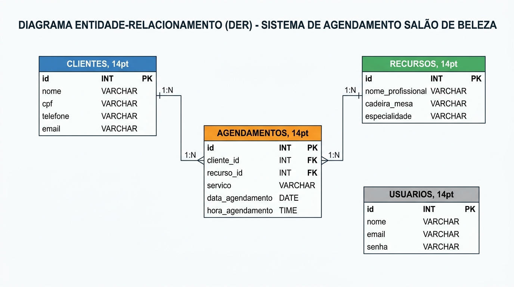

# Sistema de Agendamento - Salão de Beleza & Barbearia

> **Avaliação de Habilidade Técnica (SAEP)**  
> **Tema 12**: Salão de Beleza / Barbearia  
> **Contexto**: Agendamento de corte, coloração, manicure, barba.  
> **Regra de Conflito Mandatória**: *Não pode haver dois clientes agendados com o mesmo Profissional/Cadeira no mesmo horário.*

---

## 📋 Sumário das Entregas Esperadas

| Nº | Nome da Entrega | Tipo de Entrega | Localização no Repositório |
|:--:|---|---|---|
| **1** | Lista de Requisitos Funcionais | Documentação (Anexo III) | [Seção 1 deste README](#1-lista-de-requisitos-funcionais-anexo-iii) |
| **2** | Diagrama Entidade Relacionamento (DER) | Imagem (.png / .jpeg) | [`database/der.png`](./database/der.png) e [Seção 2](#2-diagrama-entidade-relacionamento-der) |
| **3** | Script de Criação e População do BD | Script SQL (`saep_agendamento_db.sql`) | [`database/saep_agendamento_db.sql`](./database/saep_agendamento_db.sql) |
| **4** | Backend (API REST) | Node.js + Express | [`backend/`](./backend/) |
| **5** | Frontend: Interface de Login | Angular Component | [`frontend/src/app/components/login/`](./frontend/src/app/components/login/) |
| **6** | Frontend: Interface Principal | Angular Component | [`frontend/src/app/components/header/`](./frontend/src/app/components/header/) |
| **7** | Frontend: Cadastro de Clientes | Angular Component | [`frontend/src/app/components/clientes/`](./frontend/src/app/components/clientes/) |
| **8** | Frontend: Agendamentos & Conflito | Angular Component | [`frontend/src/app/components/agendamentos/`](./frontend/src/app/components/agendamentos/) |
| **9** | Casos de Teste de Software | Documentação de Testes | [Seção 9 deste README](#9-casos-de-teste-de-software-anexo-iii) |
| **10** | Requisitos de Infraestrutura | Documentação de Sistema | [Seção 10 deste README](#10-requisitos-de-infraestrutura-anexo-iii) |

---

## 1. Lista de Requisitos Funcionais (ANEXO III)

| Identificador | Nome do Requisito | Descrição Detalhada |
|---|---|---|
| **RF-01** | Autenticação de Usuário | O sistema deve permitir que o operador acesse o sistema através de e-mail e senha cadastrados. |
| **RF-02** | Exibição de Falha de Login | O sistema deve validar as credenciais informadas e, em caso de erro, exibir na tela o motivo específico da falha. |
| **RF-03** | Identificação do Usuário Logado | A interface principal deve exibir no cabeçalho o nome do usuário autenticado no sistema. |
| **RF-04** | Encerramento de Sessão (Logout) | A aplicação deve fornecer botão de logout visível para revogar a sessão e redirecionar para a tela de login. |
| **RF-05** | Navegação do Sistema | O menu principal deve oferecer acesso direto e intuitivo às áreas de "Clientes" e "Agendamentos". |
| **RF-06** | Listagem de Clientes | O sistema deve listar todos os clientes cadastrados em formato de grade/tabela consumindo a API REST. |
| **RF-07** | Busca / Filtro de Clientes | O sistema deve fornecer campo de pesquisa para filtrar clientes dinamicamente por nome ou número de CPF. |
| **RF-08** | Manutenção de Clientes (CRUD) | O sistema deve possibilitar a inserção de novos clientes, edição de clientes existentes e exclusão com confirmação. |
| **RF-09** | Validação Visual de Campos | O formulário de clientes deve destacar visualmente (borda vermelha e aviso) os campos obrigatórios não preenchidos. |
| **RF-10** | Listagem de Agendamentos | O sistema deve exibir os agendamentos já marcados contendo data, horário, cliente, profissional/cadeira e serviço. |
| **RF-11** | Seleção Dinâmica de Recursos | O formulário de agendamento deve apresentar um dropdown populado dinamicamente com os recursos (profissionais e cadeiras). |
| **RF-12** | Validação de Conflito de Horário | **(Obrigatório)** Ao tentar agendar, caso o recurso selecionado já possua horário na mesma data e hora, a API deve retornar erro e a interface deve exibir alerta bloqueador. |

---

## 2. Diagrama Entidade Relacionamento (DER)

O DER modela o domínio do salão/barbearia contemplando autenticação, clientes, profissionais/cadeiras (recursos) e os agendamentos.

### Imagem Oficial do DER
A imagem do diagrama está salva no repositório em [`database/der.png`](./database/der.png) e [`database/der.jpeg`](./database/der.jpeg).



### Representação Textual / Relacionamentos

```text
+-------------------------+             +----------------------------------+
|        CLIENTES         |             |             RECURSOS             |
+-------------------------+             +----------------------------------+
| id (PK)                 |             | id (PK)                          |
| nome                    |             | nome_profissional                |
| cpf (UNIQUE)            |             | cadeira_mesa                     |
| telefone                |             | especialidade                    |
| email                   |             +----------------------------------+
+-------------------------+                               |
            |                                             |
            | 1                                           | 1
            |                                             |
            | N                                           | N
+--------------------------------------------------------------------------+
|                              AGENDAMENTOS                                |
+--------------------------------------------------------------------------+
| id (PK)                                                                  |
| cliente_id (FK -> clientes.id)                                           |
| recurso_id (FK -> recursos.id)                                           |
| servico (Corte, Coloração, Manicure, Barba)                              |
| data_agendamento (DATE)                                                  |
| hora_agendamento (TIME)                                                  |
| criado_em (TIMESTAMP)                                                    |
| CONSTRAINT UNIQUE: (recurso_id, data_agendamento, hora_agendamento)       |
+--------------------------------------------------------------------------+

+-------------------------+
|        USUARIOS         |
+-------------------------+
| id (PK)                 |
| nome                    |
| email (UNIQUE)          |
| senha                   |
+-------------------------+
```

---

## 3. Script de Criação e População do Banco de Dados

O script SQL está localizado em [`database/saep_agendamento_db.sql`](./database/saep_agendamento_db.sql):

- **3.1. Nome do Banco**: `saep_agendamento_db`
- **3.2. Tabela de Recursos (Mínimo de 5 registros)**:
  1. `Barbeiro Pedro` | *Cadeira 01 - Barbearia* | Especialidade: *Barba e Corte Masculino*
  2. `Cabeleireira Ana` | *Cadeira 02 - Salão Principal* | Especialidade: *Coloração e Corte Feminino*
  3. `Manicure Beatriz` | *Mesa 01 - Esmalteria* | Especialidade: *Manicure e Pedicure*
  4. `Barbeiro Antonio` | *Cadeira 03 - Barbearia* | Especialidade: *Corte Degradê e Barba*
  5. `Esteticista Carla` | *Sala 01 - Estética* | Especialidade: *Limpeza de Pele e Sobrancelha*
- **Restrição de Conflito no Banco**: `UNIQUE KEY uq_conflito_agendamento (recurso_id, data_agendamento, hora_agendamento)`

---

## 4. Backend (API REST)

Desenvolvido em **Node.js** com framework **Express**, aplicando Clean Code (funções curtas de até 20 linhas), arquitetura modular (SOLID) e comentários em `pt-BR`.

### Endpoints Disponíveis

| Método | Endpoint | Descrição | Retorno Sucesso | Erros Previstos |
|---|---|---|:---:|:---:|
| `POST` | `/api/login` | Autentica usuário | `200 OK` (dados do usuário) | `401 Unauthorized` |
| `GET` | `/api/recursos` | Lista recursos (profissionais/cadeiras) | `200 OK` (array JSON) | `500 Internal Error` |
| `GET` | `/api/clientes` | Lista clientes (suporta `?busca=nome_ou_cpf`) | `200 OK` (array JSON) | `500 Internal Error` |
| `POST` | `/api/clientes` | Cadastra novo cliente | `201 Created` | `400 Bad Request` |
| `PUT` | `/api/clientes/:id` | Atualiza dados do cliente | `200 OK` | `400 / 500` |
| `DELETE`| `/api/clientes/:id` | Remove cliente | `200 OK` | `500 Internal Error` |
| `GET` | `/api/agendamentos` | Lista agendamentos com JOINs | `200 OK` (array JSON) | `500 Internal Error` |
| `POST` | `/api/agendamentos` | **Cria agendamento com validação de conflito** | `201 Created` | `409 Conflict` / `400` |

---

## 5 a 8. Interfaces do Sistema (Frontend Angular)

Desenvolvido em **Angular 22** com componentes standalone, formulários reativos/template-driven e design responsivo.

- **5. Tela de Login**:
  - Formulário com campos de E-mail e Senha.
  - Credenciais de teste: `admin@salao.com` / `2401`.
  - Tratamento de erro: banner visual em vermelho informando o motivo exato caso ocorra falha de credenciais.
- **6. Interface Principal (Header)**:
  - Exibe o nome do usuário autenticado no canto superior.
  - Botão de logout ("Sair") que limpa a sessão e redireciona.
  - Links de navegação para "Agendamentos" e "Clientes".
- **7. Cadastro de Clientes**:
  - Tabela com listagem em tempo real.
  - Campo de busca instantânea filtrando por nome ou CPF.
  - Formulário modal para inclusão e edição de clientes.
  - Validação visual: campos obrigatórios vazios recebem borda vermelha e mensagem explicativa.
  - Exclusão com caixa de diálogo de confirmação.
- **8. Agendamentos e Regra de Conflito**:
  - Formulário com seleção de Cliente, Serviço, Data, Horário e Recurso.
  - Campo "Recurso" carregado dinamicamente via requisição para a API (`/api/recursos`).
  - **Bloqueio de Conflito**: ao submeter agendamento em horário já ocupado pelo mesmo profissional/cadeira, a API rejeita com status 409 e o Angular exibe um alerta bloqueador:  
    `🚫 CONFLITO DE AGENDAMENTO: O Profissional/Cadeira selecionado já possui um agendamento nesta data e horário!`

---

## 9. Casos de Teste de Software (ANEXO III)

| ID | Cenário de Teste | Procedimento / Passos | Dados de Entrada | Resultado Esperado | Status |
|:--:|---|---|---|---|:---:|
| **CT-01** | Autenticação com sucesso | 1. Acessar `/login`<br>2. Informar credenciais válidas<br>3. Clicar em "Entrar" | `admin@salao.com` / `2401` | Login realizado, usuário salvo na sessão e redirecionamento para `/agendamentos`. | **Aprovado** |
| **CT-02** | Autenticação com credenciais incorretas | 1. Acessar `/login`<br>2. Informar senha inválida<br>3. Clicar em "Entrar" | `admin@salao.com` / `senha123` | Exibição de alerta visual: *"E-mail ou senha inválidos."* | **Aprovado** |
| **CT-03** | Interface principal e Logout | 1. Efetuar login<br>2. Verificar nome no header<br>3. Clicar em "Sair" | Clique no botão "Sair" | Sessão limpa, cabeçalho ocultado e redirecionamento para a tela de login. | **Aprovado** |
| **CT-04** | Listagem e filtro de clientes | 1. Acessar `/clientes`<br>2. Digitar no campo de busca | Termo: `Carlos` ou `222.` | Grade exibe apenas o cliente correspondente ao filtro informado. | **Aprovado** |
| **CT-05** | Validação visual no cadastro de cliente | 1. Clicar em "Novo Cliente"<br>2. Deixar campos obrigatórios vazios<br>3. Clicar em "Salvar" | Campos vazios | Formulário não submete; bordas dos campos ficam vermelhas com mensagem de erro. | **Aprovado** |
| **CT-06** | Inclusão de novo cliente | 1. Preencher Nome, CPF e Telefone<br>2. Clicar em "Salvar" | `Lucas Mendes`, `444.555.666-77`, `(19) 98888-7777` | Cliente persistido com sucesso e adicionado na grade. | **Aprovado** |
| **CT-07** | Carregamento dinâmico de recursos | 1. Acessar tela `/agendamentos`<br>2. Abrir o select de Profissional/Cadeira | Consulta automática à API | Dropdown exibe os 5 recursos cadastrados no banco com nome e cadeira. | **Aprovado** |
| **CT-08** | Inclusão de agendamento válido | 1. Selecionar cliente, recurso, serviço, data e hora sem conflito<br>2. Clicar em "Confirmar" | Recurso: 1, Data: `2026-09-15`, Hora: `14:00` | Agendamento salvo com sucesso (HTTP 201) e inserido na tabela de horários. | **Aprovado** |
| **CT-09** | **Validação de conflito de horário (Regra Obrigatória)** | 1. Selecionar o mesmo recurso, mesma data e mesma hora de um agendamento existente<br>2. Tentar salvar | Recurso: 1, Data: `2026-09-10`, Hora: `09:00` | **Ação bloqueada!** API responde com HTTP 409 e o Angular exibe o alerta de conflito em vermelho. | **Aprovado** |
| **CT-10** | Proteção de rotas não autenticadas | 1. Deslogar do sistema<br>2. Tentar acessar `/agendamentos` diretamente pela URL | Acesso direto via navegador | `AuthGuard` bloqueia o acesso e redireciona automaticamente para `/login`. | **Aprovado** |

---

## 10. Requisitos de Infraestrutura (ANEXO III)

| Categoria | Especificação | Versão Utilizada |
|---|---|---|
| **Sistema Operacional** | Windows | Windows 11 (win32 x64) |
| **SGBD** | MySQL Server / MariaDB | 8.0+ |
| **Nome do Banco de Dados** | `saep_agendamento_db` | UTF-8 / InnoDB |
| **Ambiente de Execução (Runtime)** | Node.js | v24.16.0 |
| **Gerenciador de Pacotes** | NPM | 12.0.2 |
| **Linguagem do Backend** | JavaScript (Node.js) | ES6+ / Express 4.19 |
| **Framework Frontend** | Angular | 22.1.5 |
| **Angular CLI** | `@angular/cli` | 22.1.7 |
| **Linguagem do Frontend** | TypeScript | 6.0.3 |

---

## 🚀 Instruções de Instalação e Execução

### 1. Banco de Dados
1. Abra o MySQL Workbench, terminal MySQL ou phpMyAdmin (XAMPP).
2. Execute o script contido em:
   ```bash
   database/saep_agendamento_db.sql
   ```
3. O banco `saep_agendamento_db` será criado e populado com os usuários, clientes e os 5 recursos.

### 2. Executando o Backend
1. Abra um terminal e acesse a pasta `backend`:
   ```bash
   cd backend
   npm install
   npm start
   ```
2. O servidor estará rodando em: `http://localhost:3000`.

> **Nota de Resiliência**: Caso o serviço do MySQL local não esteja ativo no momento da avaliação, o backend ativa automaticamente uma camada de fallback em memória com todos os dados semeados para possibilitar a avaliação completa das interfaces sem interrupções!

### 3. Executando o Frontend (Angular)
1. Em outro terminal, acesse a pasta `frontend`:
   ```bash
   cd frontend
   npm install
   npm start
   ```
2. Abra seu navegador em: `http://localhost:4200`.
3. Utilize o login:
   - **E-mail**: `admin@salao.com`
   - **Senha**: `2401`
